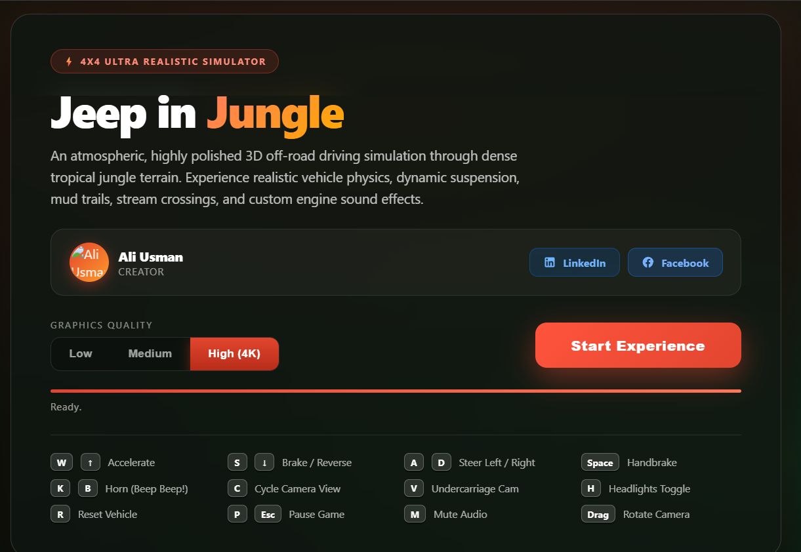
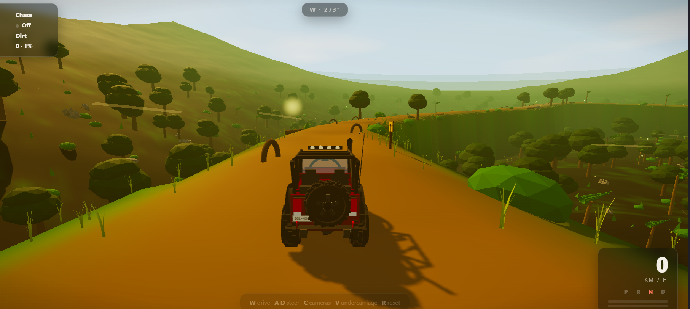

# 🚙 Jeep in Jungle

<p align="center">
  <strong>An immersive browser-based 3D off-road driving simulator built with Three.js, WebGL, and the Web Audio API.</strong>
</p>

<p align="center">
  Drive a detailed 4×4 through dense tropical jungle terrain featuring rugged trails, mud, rocky climbs, water crossings, dynamic suspension, environmental effects, multiple camera modes, and procedural audio.
</p>

<p align="center">
  <a href="https://github.com/shawn-cse/jungle-jeep"><strong>Repository</strong></a>
  ·
  <a href="https://shawn-cse.github.io/jungle-jeep/"><strong>Live Demo</strong></a>
  ·
  <a href="https://www.facebook.com/shawnazd"><strong>Creator</strong></a>
</p>

---

## 📸 Preview

<p align="center">
  
</p>

> **Note:** The Live Demo link will work after GitHub Pages is enabled for this repository.

---

## 🎮 In-Game Screenshot

<p align="center">
  
</p>

## 🎮 About the Project

**Jeep in Jungle** is a cinematic 3D off-road driving experience that runs directly in a modern web browser. The project combines procedural terrain, a custom 4×4 vehicle model, surface-aware driving behavior, dynamic suspension, collision handling, environmental effects, interactive cameras, particle systems, and procedural sound into a single lightweight web experience.

No traditional game engine is required. The simulation is built with browser-native technologies and **Three.js**.

---

## ✨ Features

- 🚙 Detailed procedural 4×4 vehicle
- 🌴 Dense tropical jungle environment
- 🛣️ Closed-loop off-road trail
- 🪨 Rocky climbs and rough terrain
- 🟤 Dirt and mud surfaces
- 🌊 Stream and water crossing
- 🌉 Wooden bridge section
- 🌿 Trees, palms, bushes, ferns, grass, roots, rocks, and logs
- 🛞 Dynamic wheel movement and suspension compression
- ⚙️ Custom vehicle physics and terrain response
- 💥 Collision handling for major obstacles
- 🌫️ Fog and cinematic atmosphere
- ☀️ Dynamic sunlight and shadows
- ✨ Bloom and custom color grading
- 🔥 Light shafts and firefly effects
- 💨 Dust, mud, water, smoke, and impact particles
- 🔦 Functional headlights
- 🚨 Brake and reverse lights
- 📊 Real-time speed, gear, throttle, brake, terrain, lap, and compass HUD
- 🎥 Five interactive camera modes
- 🔊 Procedural engine and environmental audio
- 📱 Touch controls for compatible devices
- 🖥️ Three graphics-quality presets
- ⏸️ Pause, recovery, audio, and camera controls
- 🛡️ WebGL compatibility check

---

## 🎥 Camera Modes

The simulator includes five camera perspectives:

| Camera | Description |
|---|---|
| **Chase Camera** | Main third-person driving view |
| **Cockpit Camera** | Driver-focused interior perspective |
| **Orbit Camera** | Rotate around and inspect the Jeep |
| **Undercarriage Camera** | Low view of suspension and underbody movement |
| **Wheel Camera** | Close-up off-road wheel perspective |

---

## ⌨️ Controls

### Driving

| Key | Action |
|---|---|
| `W` / `↑` | Accelerate |
| `S` / `↓` | Brake / Reverse |
| `A` | Steer Left |
| `D` | Steer Right |
| `Space` | Handbrake |
| `R` | Recover Vehicle |

### Camera & Interaction

| Key / Input | Action |
|---|---|
| `C` | Change Camera |
| `V` | Undercarriage View |
| `Mouse Drag` | Look Around / Rotate Camera |
| `Mouse Wheel` | Adjust camera distance where supported |

### Vehicle & System

| Key | Action |
|---|---|
| `H` | Toggle Headlights |
| `K` / `B` | Horn |
| `M` | Toggle Audio |
| `P` / `Esc` | Pause / Resume |

---

## 🖥️ Graphics Quality

Choose a rendering profile before launching the simulation.

### Performance
Optimized for lower-powered devices with reduced vegetation, particles, shadow resolution, terrain detail, and render scale.

### Balanced
Recommended for most desktop and laptop systems.

### Ultra (4K)
Highest visual preset with dense vegetation, high-resolution shadows, increased particles, greater terrain detail, and extended view distance.

> Actual performance depends on GPU capability, browser, screen resolution, and device pixel ratio.

---

## 🛠️ Technology Stack

| Technology | Usage |
|---|---|
| **HTML5** | Application structure |
| **CSS3** | Start screen, HUD, responsive interface |
| **JavaScript ES Modules** | Simulation logic |
| **Three.js** | 3D scene and rendering |
| **WebGL** | Hardware-accelerated graphics |
| **Web Audio API** | Procedural sound system |
| **EffectComposer** | Post-processing pipeline |
| **UnrealBloomPass** | Bloom effect |
| **ShaderPass** | Custom cinematic color grading |
| **OutputPass** | Final post-processing output |

The current version uses **Three.js 0.169.0** through UNPKG.

---

## 🧱 Project Structure

```text
jungle-jeep/
├── index.html
├── screenshot.png
├── game-screenshot.png
└── README.md
```

### `index.html`
Contains the complete simulation, including:

- interface and styling
- Three.js scene
- terrain generation
- trail generation
- environment
- vehicle model
- vehicle physics
- suspension
- collision logic
- cameras
- input controls
- particle effects
- audio
- HUD
- rendering loop

### `screenshot.png`
Repository preview image used in this README.

### `README.md`
Project documentation.

---

## 🚀 Run Locally

### 1. Clone the repository

```bash
git clone https://github.com/shawn-cse/jungle-jeep.git
cd jungle-jeep
```

### 2. Start a local web server

Using Python:

```bash
python -m http.server 8000
```

Then open:

```text
http://localhost:8000
```

You can also use the **Live Server** extension in Visual Studio Code.

> Running through a local HTTP server is recommended because the project uses JavaScript ES modules and remote Three.js imports.

---

## 🌐 Deploy with GitHub Pages

Because the main application is named `index.html`, the project can be deployed directly with GitHub Pages.

1. Open the GitHub repository.
2. Go to **Settings**.
3. Open **Pages**.
4. Under **Build and deployment**, choose:
   - **Source:** Deploy from a branch
   - **Branch:** `main`
   - **Folder:** `/ (root)`
5. Save the settings.
6. Wait for GitHub Pages to deploy.

The project should then be available at:

```text
https://shawn-cse.github.io/jungle-jeep/
```

---

## 🌍 Environment & Terrain

The environment is generated procedurally using deterministic noise, seeded random placement, and a closed spline-based trail.

The jungle includes:

- broadleaf trees
- palm trees
- bushes
- ferns
- grass
- rocks
- exposed roots
- fallen logs
- signs
- distant jungle silhouettes
- water
- bridge structures

Terrain variation includes:

- large hills
- medium-scale elevation
- surface detail
- wheel ruts
- potholes
- uneven trail sections
- rocky areas
- stream carving

---

## 🛞 Vehicle Physics

The project uses a custom lightweight vehicle controller rather than a third-party rigid-body vehicle engine.

The simulation models:

- acceleration
- braking
- reversing
- steering
- speed-sensitive steering
- lateral slip
- handbrake behavior
- rolling resistance
- terrain slope response
- surface-specific grip
- drag
- wheel rotation
- suspension travel
- chassis pitch
- chassis roll
- acceleration dive
- axle articulation
- impact response
- vehicle recovery

The configured maximum forward speed is approximately **168 km/h**.

---

## 🧭 Surface System

The Jeep reacts differently depending on the current terrain.

| Surface | Behavior |
|---|---|
| **Dirt** | Standard trail grip and resistance |
| **Mud** | Lower grip and stronger drag |
| **Rock** | Rougher suspension response |
| **Grass** | Reduced traction |
| **Water** | Increased drag and reduced acceleration |

Surface type also influences particles and tire audio.

---

## 🌊 Water System

The stream section uses a custom shader-driven water surface featuring:

- animated waves
- ripple variation
- transparency
- color variation
- specular shimmer
- splash particles
- water-specific driving physics
- procedural splash sound

---

## 💥 Collision System

Major environmental objects can physically block the vehicle.

Collision-enabled obstacles include:

- tree trunks
- large rocks
- fallen logs

Collisions can trigger:

- position correction
- speed reduction
- bounce response
- impact particles
- vehicle vibration
- camera shake
- impact audio

---

## 🌅 Lighting & Atmosphere

The visual presentation combines several real-time techniques:

- hemisphere lighting
- ambient lighting
- directional sunlight
- dynamic shadow maps
- exponential fog
- procedural sky
- cinematic color grading
- bloom
- vignette
- light shafts
- moving vegetation
- glowing fireflies

The directional sunlight follows the active driving area to maintain useful real-time shadows around the vehicle.

---

## ✨ Post-Processing

The rendering pipeline is:

```text
3D Scene
   ↓
RenderPass
   ↓
UnrealBloomPass
   ↓
Custom Color Grade Shader
   ↓
OutputPass
```

The custom grading shader enhances:

- contrast
- saturation
- warm highlights
- jungle greens
- cinematic depth
- subtle vignette

---

## 💨 Particle System

A reusable particle pool provides effects without continually creating new objects.

Particle effects include:

- road dust
- mud spray
- water splashes
- exhaust smoke
- collision debris

The particle behavior changes according to vehicle speed and terrain.

---

## 🔊 Audio System

The simulator uses the browser's **Web Audio API** to generate sound procedurally.

Audio includes:

- engine tone
- RPM/load response
- sub-engine layer
- tire noise
- terrain variation
- skid sound
- horn
- collision thump
- water splash
- jungle wind
- insect ambience
- bird calls
- procedural background music

No primary external audio files are required.

> Browsers require user interaction before audio can begin, so sound starts when the player launches the experience.

---

## 📊 In-Game HUD

The HUD provides real-time information including:

- speed in km/h
- current gear
- throttle level
- brake level
- active camera
- headlight status
- current surface
- lap count
- route progress
- compass heading
- vehicle recovery warning
- temporary system notifications

---

## 📱 Mobile & Touch Support

On touch-capable devices, the simulator can display controls for:

- acceleration
- braking
- steering left
- steering right
- camera switching

For mobile hardware, **Performance** or **Balanced** quality is recommended.

---

## ⚡ Performance Tips

For better performance:

1. Use **Performance** or **Balanced** graphics mode.
2. Enable browser hardware acceleration.
3. Use an up-to-date browser.
4. Close unnecessary GPU-heavy browser tabs.
5. Avoid Ultra mode on low-power devices.
6. Keep GPU drivers updated.

The most demanding features are high-resolution shadows, terrain density, instanced vegetation, post-processing, particle effects, and high device pixel ratios.

---

## 🌐 Browser Requirements

A modern browser with support for:

- WebGL / WebGL2
- JavaScript ES Modules
- Import Maps
- Web Audio API
- modern CSS
- hardware-accelerated rendering

Recommended:

- Google Chrome
- Microsoft Edge
- Mozilla Firefox
- Safari

---

## 🧰 Troubleshooting

### Simulation does not load

Check:

- internet connection
- JavaScript availability
- browser developer console
- access to `unpkg.com`
- WebGL support
- hardware acceleration

### No audio

- Click **Launch Adventure** first.
- Make sure the browser tab is not muted.
- Check system volume.
- Press `M` to toggle in-game audio.

### Low FPS

Select **Performance** graphics mode and confirm hardware acceleration is enabled.

### Jeep becomes stuck or overturned

Press:

```text
R
```

The vehicle will recover to a recent valid trail position.

---

## 🔧 Customization

Most simulation parameters are directly editable inside `index.html`.

### Quality Presets

```javascript
const QUALITY = {
  low: { ... },
  medium: { ... },
  high: { ... }
};
```

### Vehicle Speed

```javascript
const MAX_SPEED = 46.8;
const MAX_REV = 13.5;
```

### Trail Layout

Modify the control points in:

```javascript
const CTRL = [
  ...
];
```

### Surface Physics

```javascript
const SURFACE = {
  dirt: { ... },
  mud: { ... },
  rock: { ... },
  grass: { ... },
  water: { ... }
};
```

### Environment Density

Adjust values such as:

```text
trees
palms
bushes
ferns
grass
rocks
particles
terrainSeg
```

---

## 🗺️ Future Improvements

Possible future additions include:

- mission and checkpoint system
- timed off-road challenges
- dynamic weather
- rain and wet terrain
- day/night cycle
- manual transmission
- improved drivetrain simulation
- multiple selectable vehicles
- vehicle damage
- fuel system
- gamepad support
- minimap
- wildlife
- AI vehicles
- replay system
- saved settings
- persistent lap records
- multiplayer support

---

## 👨‍💻 Creator

**Shawn**

Creator & Developer

- GitHub: [@shawn-cse](https://github.com/shawn-cse)
- Facebook: [shawnazd](https://www.facebook.com/shawnazd)

---

## 🤝 Contributions

Suggestions, bug reports, and improvements are welcome.

If you would like to contribute:

1. Fork the repository.
2. Create a feature branch.

```bash
git checkout -b feature/your-feature
```

3. Commit your changes.

```bash
git commit -m "Add your feature"
```

4. Push the branch.

```bash
git push origin feature/your-feature
```

5. Open a Pull Request.

---

## ⭐ Support

If you enjoy the project, consider giving the repository a **star** on GitHub.

It helps others discover the project and supports future development.

---

## 📄 License

No license file is currently included in this repository.

Until a license is added, the source code remains under the default copyright protections of its author. If you plan to make the project openly reusable, consider adding a standard open-source license such as **MIT**.

---

<p align="center">
  <strong>Built for immersive browser-based off-road exploration.</strong>
</p>
